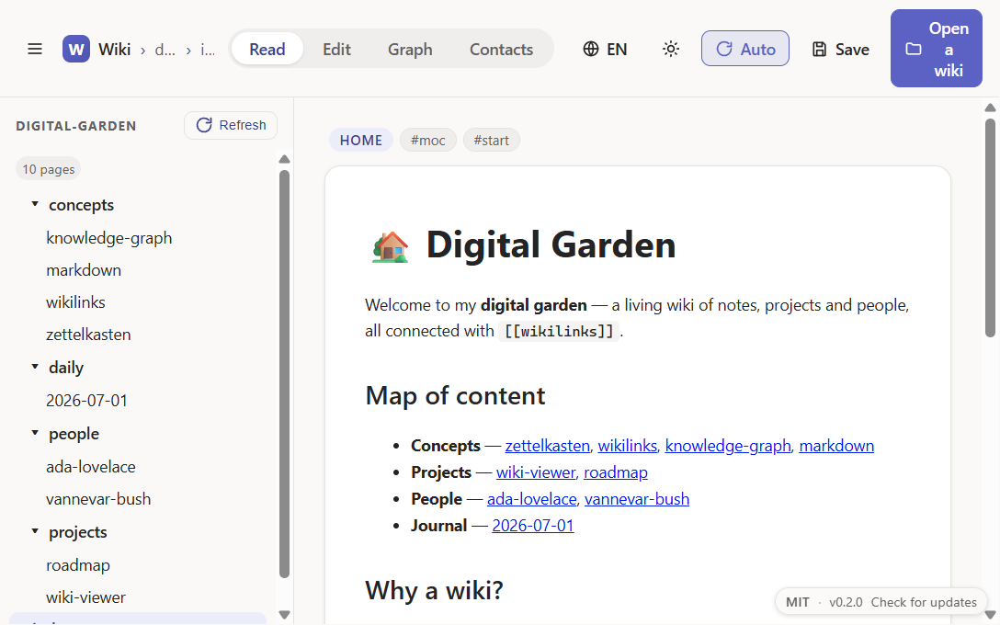
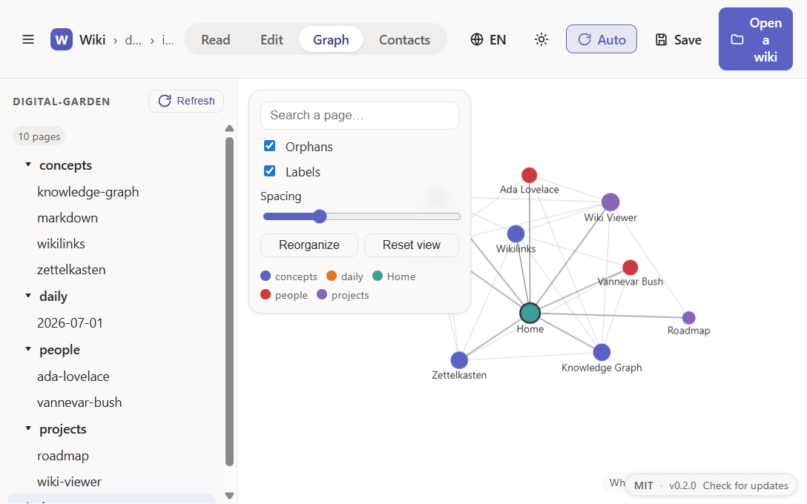
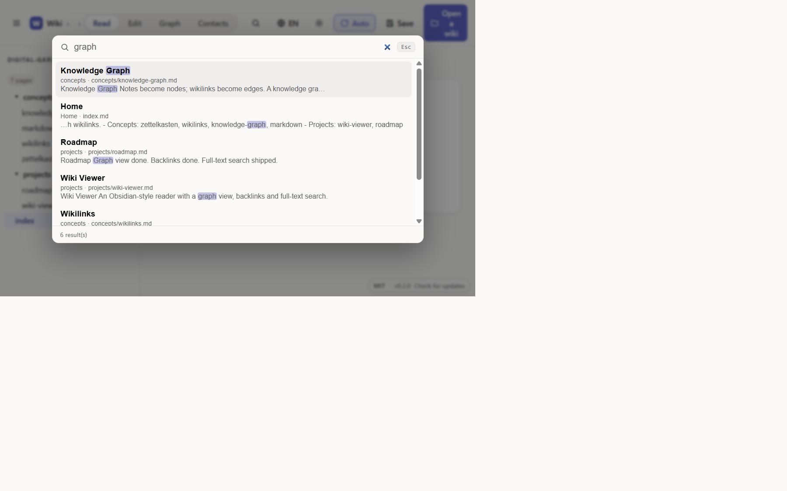
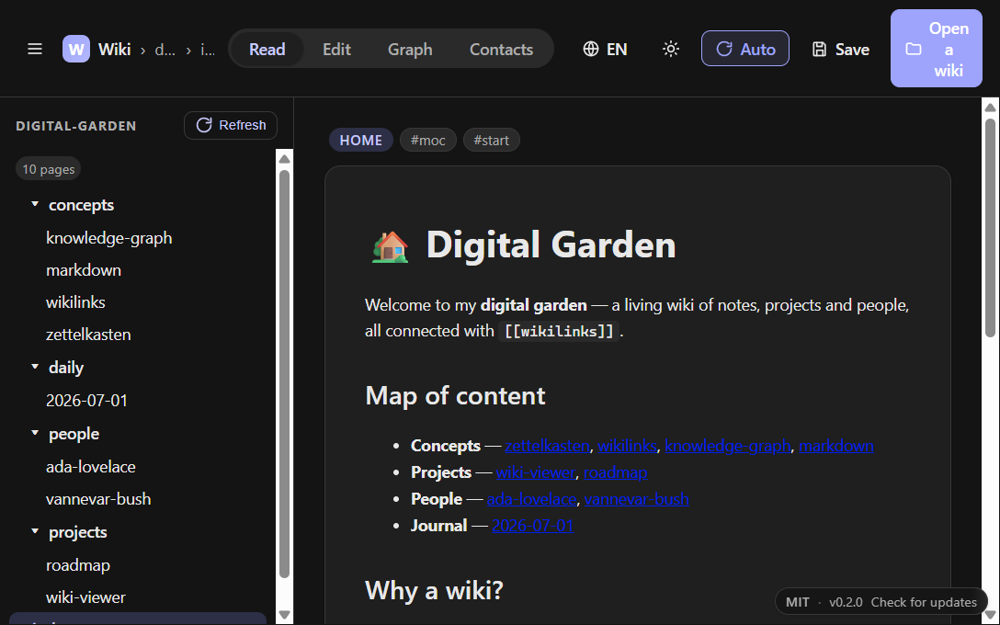

# Wiki Viewer

A web interface to view, browse and edit a Markdown wiki — designed for the
[`memory/`](../memory) folder but works with any folder of `.md` notes. Inspired
by [Obsidian](https://obsidian.md) (graph view + backlinks) and built on the
rendering/editing engine of [**Markdit**](https://github.com/EtienneSIG/Markdit).

## Overview

### Reading — Markdown rendering, `[[wikilinks]]` and file tree



### Obsidian-style graph — nodes colored by category, legend and filters



### Full-text search — `Ctrl/Cmd + K`



### Dark theme



## Features

- **Open a wiki** — one button, a folder picker (File System Access API), and the
  whole folder is loaded. The last opened folder is reopened on startup.
- **File tree** — collapsible folder/file navigation, Markdit-style.
- **Reading** — safe Markdown rendering (remark/rehype) with Shiki syntax
  highlighting, exactly like in Markdit.
- **Editing** — TipTap WYSIWYG editor; Markdown stays the source of truth (no
  proprietary format). `Ctrl/Cmd + S` saves to disk.
- **Obsidian-style graph** — force-directed graph (canvas): nodes = pages,
  edges = `[[links]]`. Wheel zoom, panning, node dragging, hover to isolate
  neighbors, search, hide orphans, labels, per-category legend. Click a node to
  open the page.
- **`[[wikilinks]]`** — `[[target]]` and `[[target|alias]]` links become
  clickable in the reader; missing targets are flagged visually.
- **Backlinks** — side panel listing the pages that point to the current page,
  plus its outgoing links.
- **Full-text search** — search palette (magnifier button or `Ctrl/Cmd + K`) that
  scans titles and content of every page, with highlighted excerpts, relevance
  ranking and keyboard navigation (↑/↓, Enter, Esc).
- **Themes** — system / light / dark / high contrast.
- **Multilingual** — interface in **English** and **French**; toggle via the
  language button in the toolbar. The language is detected from the browser on
  first launch, then remembered.

## Requirements

- **Node.js** 18+ (for the dev server / build).
- A **Chromium** browser (Edge, Chrome…): opening a folder relies on the
  [File System Access API](https://developer.mozilla.org/docs/Web/API/File_System_Access_API),
  which is not available in Firefox/Safari.

## Getting started

```bash
cd wiki-viewer
npm install
npm run dev
```

Then open http://localhost:1421, click **Open a wiki** and select the `memory`
folder (or any other folder of Markdown notes). Grant read/write access so you
can save your changes.

## Production build

```bash
npm run build      # type-check (tsc) then build dist/
npm run preview    # serve the production build
```

## Desktop apps (Windows & macOS)

The app is packaged with [Electron](https://www.electronjs.org/) via
[electron-builder]. The renderer is the same web code; the File System Access API
and IndexedDB work in Electron's Chromium runtime.

```bash
npm run electron:dev     # run the Electron app against the Vite dev server
npm run release:win      # build a Windows installer (NSIS) into release/
npm run release:mac      # build a .dmg (x64 + arm64) — requires macOS
npm run release:all      # both (each target on its native OS)
```

Artifacts are produced in the `release/` folder.

### Build both platforms automatically

macOS cannot be built from Windows (nor the reverse for signing). The
[`.github/workflows/release.yml`](.github/workflows/release.yml) workflow builds
**Windows + macOS** on native runners and publishes a GitHub Release:

```bash
git tag v0.1.0
git push origin v0.1.0   # triggers the cross-platform build + release
```

(Or trigger it manually via the *Actions* tab → *Release* → *Run workflow*.)

### Local Windows build

- `npm run release:win` produces an **NSIS installer**. Creating the signed
  installer requires extracting `winCodeSign`, which needs **Windows Developer
  Mode** enabled (or an *Administrator* terminal) to create symbolic links.
- Without those rights, use `npx electron-builder --win --dir`: it produces a
  working unpacked app in `release/win-unpacked/` (`Wiki Viewer.exe`), with no
  installer or signing.

[electron-builder]: https://www.electron.build/

## Technical notes

- **Reuses Markdit as-is** for the Markdown pipeline (`src/markdown/*`) and the
  reader/editor/toolbar components. Rendering and editing are therefore identical
  to Markdit.
- **Wiki model** (`src/lib/wiki.ts`): scans the folder, resolves `[[links]]` (by
  slug, title or path), builds the file tree, the graph and the backlinks.
  `buildModel()` is pure (no browser API) and recomputed after each save to
  refresh the graph/backlinks.
- **`[[wikilinks]]`** (`src/markdown/remark-wikilink.ts`): an mdast→mdast
  transform applied **only when rendering**, never to the editor's shared parse
  — so `[[...]]` Markdown is preserved byte-for-byte on save.
- **Frontmatter** (`src/lib/frontmatter.ts`): the YAML block is detached for
  reading/editing then re-attached verbatim on save (no destructive YAML
  round-trip).
- **Persistence**: only opaque folder handles are stored in IndexedDB; nothing
  leaves the device.
- The dev port is **1421** (Markdit uses 1420).

## License

Distributed under the [MIT](LICENSE) license. © 2026 EtienneSIG.

## Structure

```
src/
├── app/            App.tsx (shell), theme.ts
├── components/
│   ├── reader/     Reader.tsx        (Markdit + [[link]] navigation)
│   ├── editor/     Editor.tsx        (Markdit, TipTap)
│   ├── toolbar/    Toolbar.tsx, actions.ts (Markdit)
│   ├── sidebar/    FileTree.tsx      (file tree)
│   ├── backlinks/  Backlinks.tsx     (backlinks + outgoing links)
│   ├── search/     SearchPanel.tsx   (full-text search palette)
│   └── graph/      GraphView.tsx     (force-directed graph, canvas)
├── lib/            wiki.ts, search.ts, frontmatter.ts, folder-handle.ts, i18n.ts,
│                   version.ts, types.ts
├── markdown/       parse, render, sanitize, serialize, highlight, tiptap-bridge,
│                   remark-wikilink
└── styles.css      (Markdit + .wv-* additions)
```
